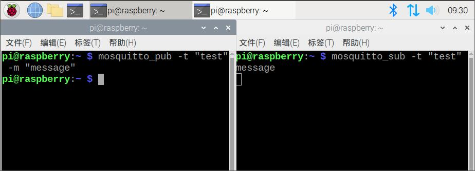
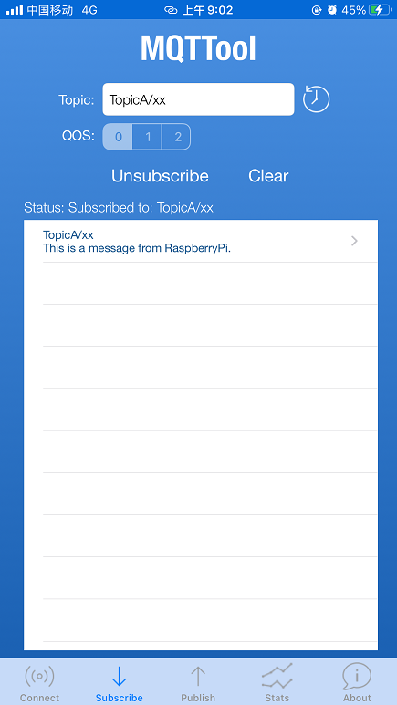
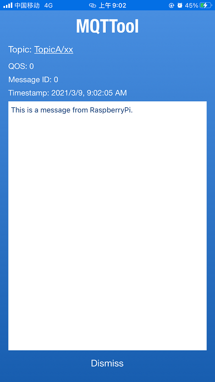

# Mosiquitto实验

## 实验一：Mosiquitto安装

在树莓派终端输入以下代码（树莓派默认密码为：`raspberry`）

```sh
# 更新软件源
sudo apt-get update
# 导入存储库签名密钥
wget http://repo.mosquitto.org/debian/mosquitto-repo.gpg.key
sudo apt-key add mosquitto-repo.gpg.key
# 切换到软件包管理目录
cd /etc/apt/sources.list.d/
# 下载mosquitto软件源
sudo wget http://repo.mosquitto.org/debian/mosquitto-buster.list
# 更新树莓派软件源
sudo apt-get update
# 安装mosquitto软件包
sudo apt-get install mosquitto mosquitto-clients
```

正常情况下，安装完成后，mosquitto服务就会自动启动，可以在树莓派终端输入以下命令查看其运行状态

```sh
# 查看mosquitto服务状态
service mosquitto status
# 停止mosquitto服务
service mosquitto stop
# 启动mosquitto服务
service mosquitto start
```

如果mosquitto的服务状态为`active (running)`，则表示该服务正常运行，按下`Ctrl+C`退出来即可


目前所实现的功能：

* 安装了Mosquitto Broker，服务器会在1883端口（默认）监听本机的连接请求
* 安装了Mosquitto Client，可以使用相关命令发布或订阅主题了

---

## 实验二：发布/订阅测试

[Mosquitto官方手册](https://mosquitto.org/documentation/)

|   命令或文件名称   |                  用途                   |
|------------------|----------------------------------------|
|mosquitto         |        运行Mosquitto代理服务             |
|mosquitto.conf    |        Mosquitto代理的配置文件           |
|mosquitto_passwd  |        用于生成Mosquitto密码文件         |
|mosquitto_pub     |        用于将消息发布到代理               |
|mosquitto_rr      |        用于与代理进行简单请求/响应的测试    |
|mosquitto_sub     |        用于在代理上订阅相应的主题          |
|mosquitto-tls     |        用于配置SSL/TLS支持               |
|mqtt              |        MQTT功能描述                      |

这里我们需要了解`mosquitto_pub`和`mosquitto_sub`这两个命令，分别用于发布和订阅主题。

两个命令所涉及的主要参数如下，详细参数请看[mosquitto_pub参考手册](https://mosquitto.org/man/mosquitto_pub-1.html)和[mosquitto_sub参考手册](https://mosquitto.org/man/mosquitto_sub-1.html)：

> mosquitto_pub命令参数

|   参数名称  | 参数名称缩写 |               用途               |
|------------|------------|----------------------------------|
| --help     |    无      | 显示帮助信息                       |
| --host     |    -h      | 指定要连接的主机，默认为localhost   |
| --port     |    -p      | 指定要连接服务器的端口号，默认为1883 |
| --id       |    -i      | 指定客户端ID，默认会自动生成        |
| --topic    |    -t      | 指定要发布的主题                   |
| --message  |    -m      | 指定要发布的消息                   |
| --username |    -u      | 指定用户名，需要配合`--pw`参数      |
| --pw       |    -P      | 指定密码，需要配合`--username`参数  |
| --file     |    -f      | 将文件内容作为消息发送              |

> mosquitto_sub命令参数

|   参数名称  | 参数名称缩写 |               用途               |
|------------|------------|----------------------------------|
| --help     |    无      | 显示帮助信息                       |
| --host     |    -h      | 指定要连接的主机，默认为localhost   |
| --port     |    -p      | 指定要连接服务器的端口号，默认为1883 |
| --id       |    -i      | 指定客户端ID，默认会自动生成        |
| --topic    |    -t      | 指定要订阅的主题                   |
| --username |    -u      | 指定用户名，需要配合`--pw`参数      |
| --pw       |    -P      | 指定密码，需要配合`--username`参数  |

### 2.1 本地测试

因为我们已经在树莓派上安装了客户端和服务器，所以可以在树莓派本地进行简单的发布订阅测试。

首先使用`service mosquitto status`命令，查看你的mosquitto服务是否处在开启状态，如果服务没启动，则使用命令启动它。

然后我们在树莓派上打开两个终端，一个用于发布消息，一个用于订阅消息

先在订阅端输入命令：

```sh
mosquitto_sub -t "test"
```

然后在发布端输入命令：

```sh
mosquitto_pub -t "test" -m "message"
```

此时订阅端就会收到相应的消息，如下图所示。



上述两行代码的含义是，订阅端首先订阅了主题为`test`的消息并阻塞等待，然后发布端向服务器发布了主题为`test`的消息，消息内容为`message`，然后订阅端就接收到了消息`message`。

这是一个本地的测试，发布是从树莓派本地发布消息到树莓派的mosquitto broker服务，订阅同样是订阅树莓派本地的broker。下面我们来测试一下向外网的服务器进行发布和订阅。

### 2.2 外网测试

我在服务器上创建了mosquitto broker服务，这样大家就可以直接访问这个服务器，实现向公网上发布/订阅消息。

> broker服务端配置信息
> * 地址："47.95.13.239"
> * 端口：1883
> * 用户名：student
> * 密码：kkxxb401
> * 客户端ID："student/xx/test" （推荐）

这里使用了用户名和密码等信息，可以让大家练习使用更多的命令参数。

同样在树莓派开启两个终端，先启动订阅客户端，输入命令：

```sh
mosquitto_sub -t "student/xx/test" -h "47.95.13.239" -p 1883 -u "student" -P "kkxxb401"
```

然后在发布端输入以下命令：

```sh
mosquitto_pub -t "student/xx/test" -h "47.95.13.239" -p 1883 -u "student" -P "kkxxb401" -m "This is test message"
```

实现的效果如下图所示


如果不使用指定的用户名和密码，或者书写有误，会出现下图的现象


这是一个外网测试，树莓派客户端发布主题信息到外网服务器，然后树莓派再订阅外网服务器对应的主题，相当于这个消息从树莓派本地发出，经过外网broker服务转发，又回到了树莓派本地。

---

## 实验三：树莓派与手机通信

实验二的外网测试部分，我们实现了下图所示的数据转发流程。


接下来使用手机配合树莓派，实现双方的数据通信，其数据的转发流程如下图所示。


手机端需要下载MQTT客户端APP

* Android 请下载 `MQTT Client`
* iOS 请下载 `MQTTool`

下面以iOS系统(MQTTool软件)为例，演示手机与树莓派互传数据的过程

* 打开MQTTool软件
* `Host` 填写 `47.92.13.239`
* `Port` 填写 `1883`
* `Client ID` 可以不填，使用默认生成的ID
* `Username` 填写 `student`
* `Password` 填写 `kkxxb401`
* 点击 Connect 连接服务器

连接成功后，如下图所示，Status状态会显示 `Connected to 47.95.13.239:1883`


（备注：上图中没填密码是因为截图时密码被自动隐藏了）

连接成功后，我们分别尝试 `树莓派向手机传输数据` 以及 `手机向树莓派传输数据` 两种方式。

### 3.1 树莓派向手机传输数据

> 树莓派作为消息发布者，将以TopicA为主题的消息发布到服务器；手机作为消息接收者，从服务器订阅主题TopicA的消息。

（1）首先手机端先开启订阅

* 在MQTTool手机APP的底部选择`Subscribe`，进入订阅页面
* `Topic (主题)` 填写 `TopicA`
* `QoS (服务质量)` 选择 `0`
* 点击 `Subscribe` 订阅按钮

订阅成功后，`Status` 会显示 `Subscribed to: TopicA`

（2）在树莓派端发布一条消息

打开树莓派终端，填写以下命令

（！！注意：执行该命令时，需要确保手机端处在订阅状态，手机熄屏后有可能就断开与服务器的连接了）

```sh
mosquitto_pub -t "TopicA" -h "47.95.13.239" -p 1883 -u "student" -P "kkxxb401" -m "This is a message from RasppberryPi."
```


此时手机端就会收到该消息，如下图所示



点击该条消息可以查看相关详情



这样，来自树莓派的消息 `This is a message from RasppberryPi.` 就通过服务器转发到了手机上。

下面可以仿照 `树莓派向手机传输数据`，实现 `手机向树莓派传输数据` 的过程。

### 3.2 手机向树莓派传输数据

> 手机作为消息发布者，将以`TopicB`为主题的消息发布到服务器；树莓派作为消息订阅者，从服务器订阅主题`TopicB`的消息。

（1）首先树莓派先开启订阅

```sh
mosquitto_sub -t "TopicB" -h "47.95.13.239" -p 1883 -u "student" -P "kkxxb401"
```


（2）手机端向服务器发布以`TopicB`为主题的消息`Hello,this is from Phone.`


发布成功后，树莓派就会接收到这条消息。


## 练习

Mosquitto官方在它的服务器`test.mosquitto.org`上搭建了Mosquitto Broker服务，分为未加密、已加密、需要客户端证书等多种连接方式，对应不同的服务器端口，可在[https://test.mosquitto.org/](https://test.mosquitto.org/)查看详情。


课后可以自行测试以下内容：

* `用手机APP连接test.mosquitto.org，实现消息发布和订阅`。
* 用手机测试 `mosquitto_sub -h test.mosquitto.org -t "#"` 这条订阅指令，并解释为何会接收到`大量不同主题`的消息

---

额外说明：如果自己在服务器上搭建Mosquitto Broker服务，必须将监听服务绑定到服务器所有端口并设置连接密码，否则默认只能监听服务器本地的连接请求。这是Mosquitto新版本(2.0以上)的特性，详细信息请看[版本迁移说明](https://mosquitto.org/documentation/migrating-to-2-0/)

---

End
