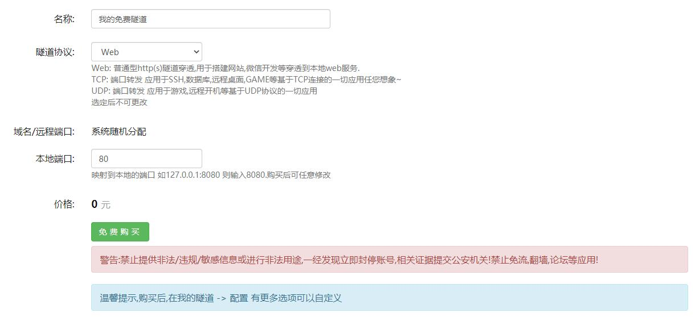
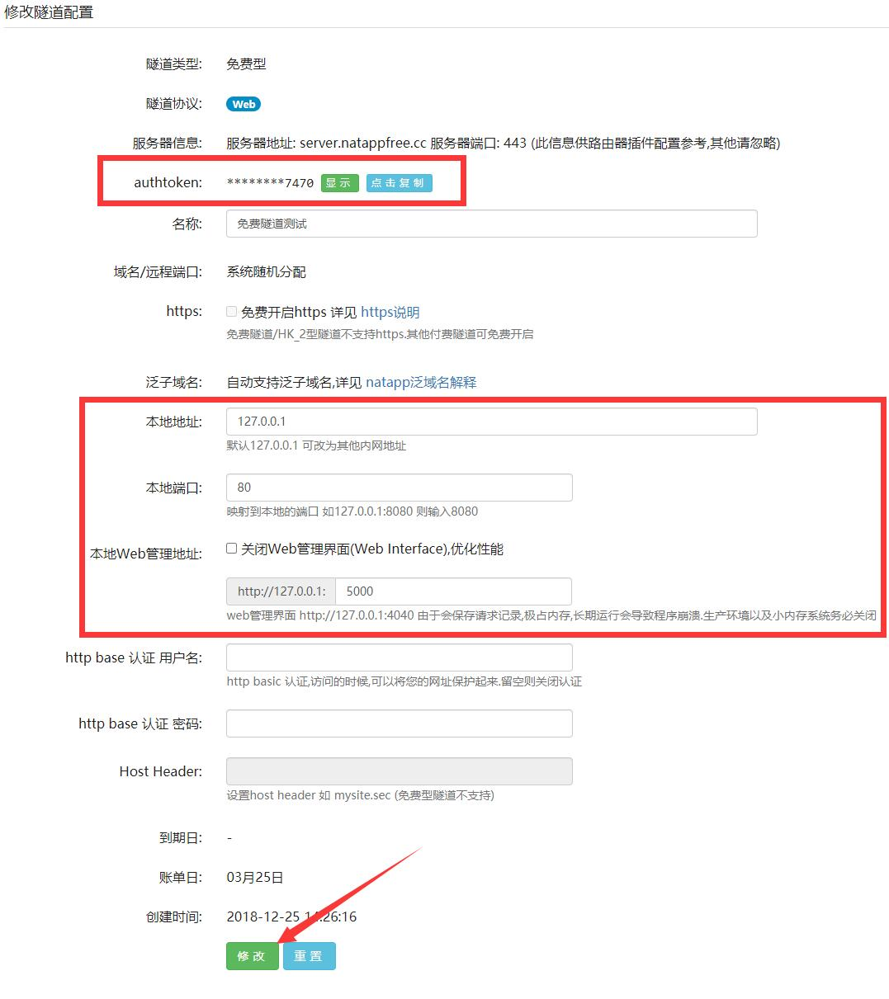
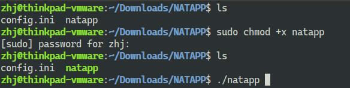
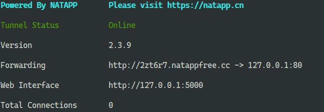
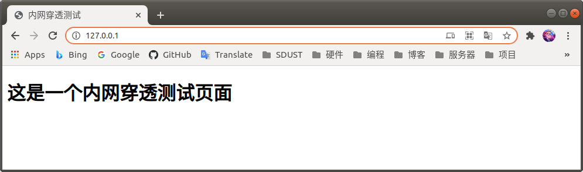
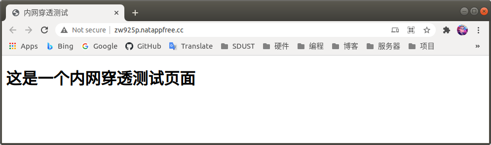
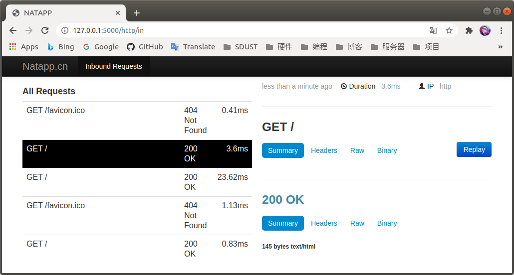

# 域名解析和内网穿透实验

## 1. 域名解析

> 由于域名解析的过程需要事先准备域名和云服务器（需要购买），带大家一起操作不太方便，所以下面只给大家讲解一下域名解析的操作过程。

* 域名：由一串用点分隔的字符组成的Internet上某一台计算机或计算机组的名称，用于在数据传输时标识计算机的电子方位，一个域名的目的是便于记忆和沟通的一组服务器的地址。（如：zhj0125.com）
* 云服务器：是一种处理能力可弹性伸缩的计算服务器，可以帮助构建更加安全稳定的应用，降低开发运维程度和成体成本，让开发者更专注于核心业务创新。（一台一直开机的服务器，会提供公网IP地址）
* DNS：域名解析系统（Domain Name System），能够通过域名定位到指定的IP地址

下面以阿里云平台为例，介绍一下域名解析：

在阿里云控制台域名列表中，可以看到自己的域名


在操作列表中，选择 `解析`，进入域名解析页面。


在该页面可以看到分配的DNS服务器、以及各条解析记录

点击 `添加记录` ，可以添加一条解析记录


其中记录类型分为A记录、CNAME记录、AAAA记录、MX记录等等

* A记录：将域名指向一个IPv4地址
* CNAME记录：将域名指向另外一个域名
* AAAA记录： 将域名指向一个IPv6地址
* MX记录：将域名指向邮件服务器地址

主机记录就是域名前缀，常见用法有：

* www：解析后的域名为 www.aliyun.com
* @：直接解析主域名 aliyun.com
* *：泛解析，匹配其他所有域名 *.aliyun.com
* mail：将域名解析为mail.aliyun.com，通常用于解析邮箱服务器
* 二级域名：如：abc.aliyun.com，填写abc
* 手机网站：如：m.aliyun.com，填写m
* 显性URL：不支持泛解析（泛解析：将所有子域名解析到同一地址

记录值需要根据记录类型，填写云服务器IP地址或者需要指向的另一个域名地址等等

以 `forever305.cn` 域名为例，在域名域名解析页面中，可以看到

|        域名地址      |   解析类型 |     被解析到的地址     |
|---------------------|-----------|----------------------|
| `forever305.cn`     | A记录     | `47.95.13.239` 服务器 |
| `www.forever305.cn` | A记录     | `47.95.13.239` 服务器 |
| `zhj.forever305.cn` | CNAME记录 | Coding Pages 网页服务  |

也就是说，如果在浏览器中输入`forever305.cn`，DNS就会浏览器地址定位到IP为`47.95.13.239`的服务器的网络端口（默认80端口），实现域名解析。

在命令行中输入以下ping指令，测试域名指向的地址

```sh
ping forever305.cn
```


同样的方法，可以测试 `www.forever305.cn` 和 `zhj.forever305.cn`。

## 2. 内网穿透

* 内网地址：局域网中设备的IP地址，用于定位局域网中的设备，如 `192.168.1.102`
* 公网地址：公网服务器所对应的IP地址，用于访问在互联网中的设备，如 `47.95.13.239`

在 `树莓派应用LNMP、BOA` 实验中，我们已经在树莓派上搭建了web服务。但是这样的服务只能在局域网中被访问到，不在同一个局域网中的设备无法访问树莓派的web服务。

为了解决这样的问题，我们可以使用 `内网穿透` 方式，将局域网web服务对应的端口，映射到公网地址对应的端口。使用内网穿透后，当我们访问公网对应的网址，就相当于访问了树莓派的web端口，实现在公网上对树莓派的访问。

### 2.1 内网穿透工具选择

常见的内网穿透服务有 [WeNAT](https://gitee.com/tompeppa/wenat-client-java)、[花生壳](https://hsk.oray.com/)、[NATAPP](https://natapp.cn/)、[Ngrok](https://ngrok.com/) 等等

~~本次使用花生壳服务，点击查看 [官网教程](https://service.oray.com/question/11639.html)~~

由于花生壳**免费版本**仅支持TCP、UDP协议，只能实现SSH等简单方式的内网穿透，不符合本次实验要求，所以改用NATAPP进行内网穿透实验。

NATAPP是基于Ngrok的反向代理服务，**免费的版本**提供了HTTP、TCP、UDP全隧道穿透功能，提供代理服务端和公网域名，并且服务在国内，方便大家使用。可以满足本次实验要求，实现将树莓派搭建的web服务转发到公网。

### 2.2 隧道配置

（1）注册和选择隧道

在NATAPP官网右上角，使用手机号注册。注册成功后登陆进去，在左侧导航栏中找到 `我的隧道` -> `购买隧道`，选择 **`免费隧道`** 的版本

填写隧道基本信息

* 隧道名称：随便填写
* 隧道协议：选择 `Web`
* 本地端口：80（填写树莓派Web服务端口）

填写完成后，点击免费购买



（2）隧道配置

购买完成后，点击 `我的隧道`，可以看到刚刚创建的隧道信息。点击该隧道右侧的 `配置` 按钮，进行详细配置。


详细配置页面中，最主要的几个配置已用红框标出，如下图所示：



* authtoken：这是验证信息，一会用到
* 本地地址：是指局域网中需要被映射的内网地址，因为我们在树莓派本地搭建NATAPP客户端，所以这里只需填写 `127.0.0.1` 这个本机地址即可。
* 本地端口：是指局域网中需要被映射的内网地址的端口，因为我们搭建的服务器默认端口是80端口，所以这里填写`80`即可。
* 本地Web管理地址：一会我们安装的NATAPP客户端是一个命令行界面，如果开启了这个管理地址，就会在这个管理地址启动一个图形界面，方便用户管理。这里我们填写 `5000`。

填写完成后，点击下面的 `修改` 按钮保存配置。

### 2.3 客户端配置

在NATAPP页面的右上标题栏找到 `客户端下载`，右键点击 `Linux/ARM 32位` 的按钮，选择 `链接另存为`，选择文件保存路径。

需要注意下载的位置，默认应该是 `/home/pi/Download` 目录下

新建一个文件夹，把下载的NATAPP客户端文件移动到这个文件夹中。

```sh
mkdir NATAPP            # 创建NATAPP文件夹
mv natapp NATAPP/       # 将natapp客户端文件移动到NATAPP文件夹中
cd NATAPP/              # 切换当前目录到NATAPP文件夹
```

客户端启动之前，需要编写配置文件。在NATAPP文件夹内，创建一个名为 `config.ini` 的文件，向其中写入以下内容：

```sh
#将本文件放置于natapp同级目录 程序将读取 [default] 段
#在命令行参数模式如 natapp -authtoken=xxx 等相同参数将会覆盖掉此配置
#命令行参数 -config= 可以指定任意config.ini文件
[default]
authtoken=13c18e48fc1c7470      #对应一条隧道的authtoken
clienttoken=                    #对应客户端的clienttoken,将会忽略authtoken,若无请留空,
log=none                        #log 日志文件,可指定本地文件, none=不做记录,stdout=直接屏幕输出 ,默认为none
loglevel=ERROR                  #日志等级 DEBUG, INFO, WARNING, ERROR 默认为 DEBUG
http_proxy=                     #代理设置 如 http://10.123.10.10:3128 非代理上网用户请务必留空
```

该文件是官方给的配置文件，详见[使用本地配置文件config.ini](https://natapp.cn/article/config_ini)

文件内容已经写得很清楚了，其中需要改的只有一个 `authtoken`，将 `13c18e48fc1c7470` 改成你自己的`authtoken`。修改完成后，保存该文件，然后在终端中执行以下代码：

```sh
sudo chmod +x natapp        # 为客户端程序添加执行权限
./natapp                    # 执行客户端程序
```



执行成功后，显示如下界面：



可以看到，NATAPP服务已经将我本地的`127.0.0.1:80`本地地址映射到了`http://2zt6r7.natappfree.cc`公网地址。

现在我已经在本地搭建了LAMP服务，打开浏览器输入`127.0.0.1:80`，如下图所示：



这是本地Apache服务的默认页面，我现在去访问`http://2zt6r7.natappfree.cc`这个公网地址。大家需要输入你自己的公网地址。



可以看到，公网与树莓派本地显示的内容是一样的，这样说明内网穿透功能已经实现了。

在浏览器输入`http://127.0.0.1:5000/`可以进入管理页面，看到网页的请求信息。



---

End
