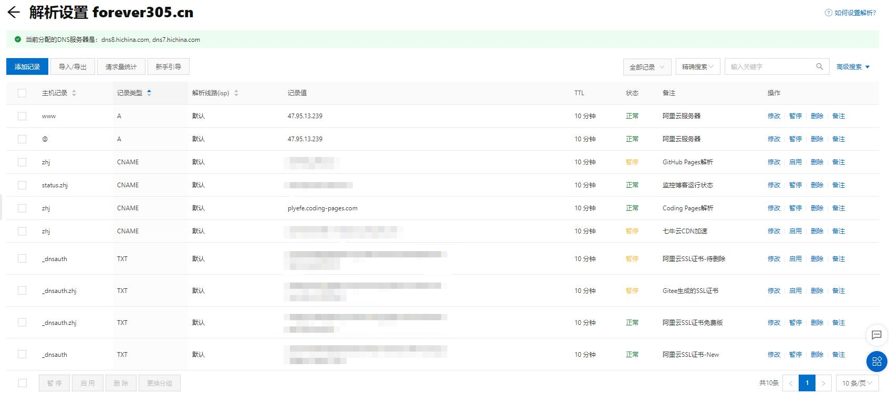
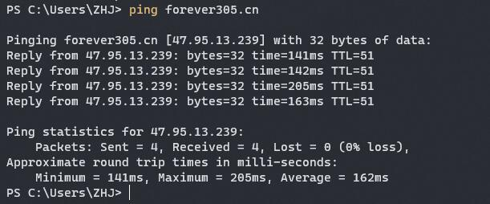

# 域名解析和内网穿透实验

## 1. 域名解析

> 由于域名解析的过程需要事先准备域名和云服务器（需要购买），带大家一起操作不太方便，所以下面只给大家讲解一下域名解析的操作过程。

* 域名：由一串用点分隔的字符组成的Internet上某一台计算机或计算机组的名称，用于在数据传输时标识计算机的电子方位，一个域名的目的是便于记忆和沟通的一组服务器的地址。（如：zhj0125.com）
* 云服务器：是一种处理能力可弹性伸缩的计算服务器，可以帮助构建更加安全稳定的应用，降低开发运维程度和成体成本，让开发者更专注于核心业务创新。（一台一直开机的服务器，会提供公网IP地址）
* DNS：域名解析系统（Domain Name System），能够通过域名定位到指定的IP地址

下面以阿里云平台为例，介绍一下域名解析：

在阿里云控制台域名列表中，可以看到自己的域名


在操作列表中，选择 `解析`，进入域名解析页面。



在该页面可以看到分配的DNS服务器、以及各条解析记录

点击 `添加记录` ，可以添加一条解析记录


其中记录类型分为A记录、CNAME记录、AAAA记录、MX记录等等

* A记录：将域名指向一个IPv4地址
* CNAME记录：将域名指向另外一个域名
* AAAA记录： 将域名指向一个IPv6地址
* MX记录：将域名指向邮件服务器地址

主机记录就是域名前缀，常见用法有：

* www：解析后的域名为 www.aliyun.com
* @：直接解析主域名 aliyun.com
* *：泛解析，匹配其他所有域名 *.aliyun.com
* mail：将域名解析为mail.aliyun.com，通常用于解析邮箱服务器
* 二级域名：如：abc.aliyun.com，填写abc
* 手机网站：如：m.aliyun.com，填写m
* 显性URL：不支持泛解析（泛解析：将所有子域名解析到同一地址

记录值需要根据记录类型，填写云服务器IP地址或者需要指向的另一个域名地址等等

以 `forever305.cn` 域名为例，在域名域名解析页面中，可以看到

|        域名地址      |   解析类型 |     被解析到的地址     |
|---------------------|-----------|----------------------|
| `forever305.cn`     | A记录     | `47.95.13.239` 服务器 |
| `www.forever305.cn` | A记录     | `47.95.13.239` 服务器 |
| `zhj.forever305.cn` | CNAME记录 | Coding Pages 网页服务  |

也就是说，如果在浏览器中输入`forever305.cn`，DNS就会浏览器地址定位到IP为`47.95.13.239`的服务器的网络端口（默认80端口），实现域名解析。

在命令行中输入以下ping指令，测试域名指向的地址

```sh
ping forever305.cn
```



同样的方法，可以测试 `www.forever305.cn` 和 `zhj.forever305.cn`。

## 2. 内网穿透

* 内网地址：局域网中设备的IP地址，用于定位局域网中的设备，如 `192.168.1.102`
* 公网地址：公网服务器所对应的IP地址，用于访问在互联网中的设备，如 `47.95.13.239`

在 `树莓派应用LNMP、BOA` 实验中，我们已经在树莓派上搭建了web服务，但是这样的服务只能在局域网中被访问到，不在同一个局域网中的设备无法访问树莓派的web服务。为了解决这样的问题，我们可以使用 `内网穿透` 方式，将局域网web服务对应的端口，映射到公网地址对应的端口。使用内网穿透后，当我们访问公网对应的网址，就相当于访问了树莓派的web端口，实现在公网上对树莓派的访问。

常见的内网穿透服务有 [WeNAT](https://gitee.com/tompeppa/wenat-client-java)、[花生壳](https://hsk.oray.com/)、[NATAPP](https://natapp.cn/)、[Ngrok](https://ngrok.com/) 等等

本次使用花生壳服务，点击查看 [官网教程](https://service.oray.com/question/11639.html)


