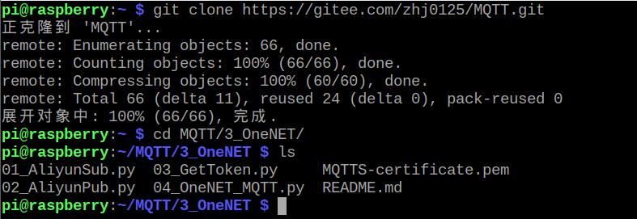
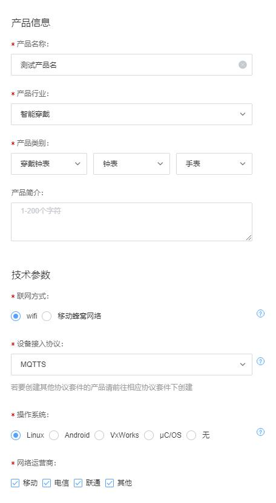
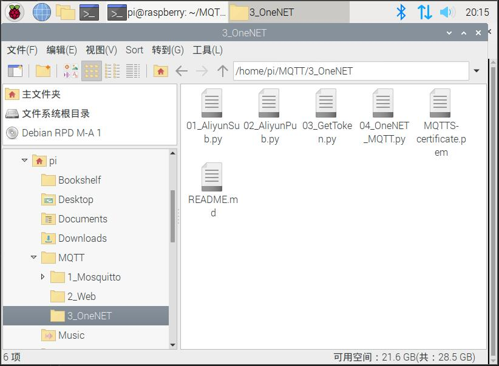
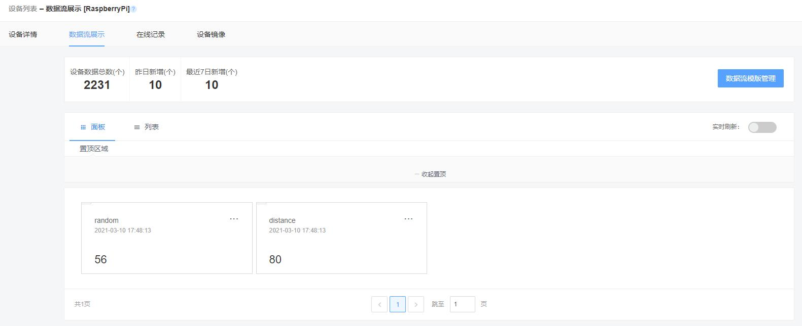
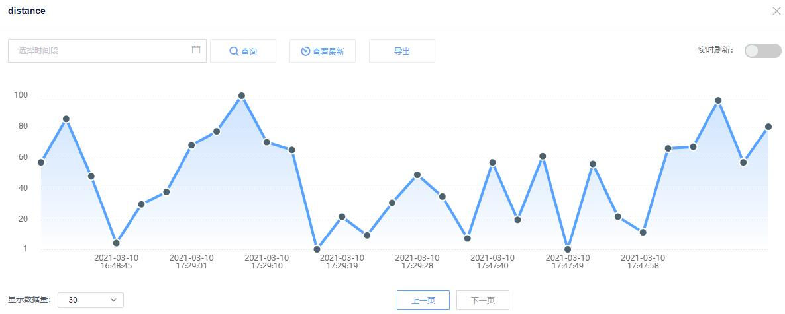
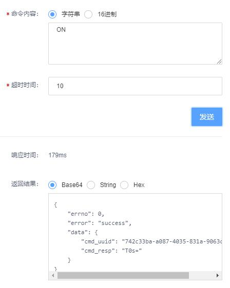
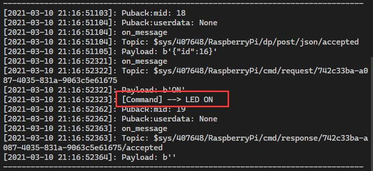
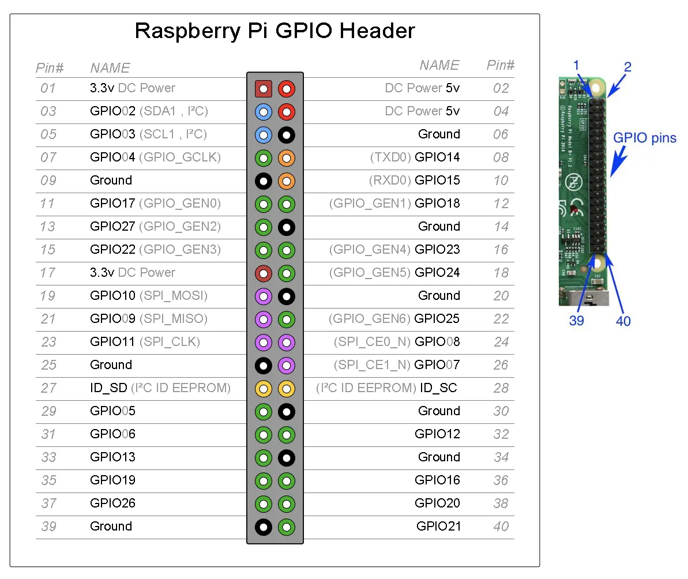
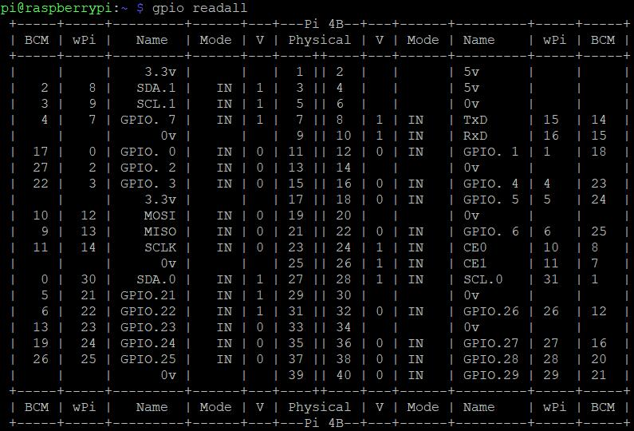

# OneNET云平台实验

## 1. 准备工作

> 需要安装paho-mqtt并下载实验代码

### 1.1 下载paho-mqtt

在树莓派的终端输入以下命令，检查环境

```sh
python3 -V                              # 显示python3的版本
pip3 -V                                 # 显示pip包管理工具的版本
sudo pip3 install --upgrade RPI.GPIO    # 安装树莓派GPIO控制包
```

输入以下命令安装paho-mqtt

```sh
pip3 install paho-mqtt
```

看到 `Successfully installed paho-mqtt-1.5.1` 说明安装成功

### 1.2 下载实验代码

实验过程需要编写一些代码，建议使用以下指令下载代码，并进入项目目录

```sh
git clone https://gitee.com/zhj0125/MQTT.git    # 下载实验代码
cd MQTT/3_OneNET/                               # 切换到代码目录
```

如下图所示



---

## 2. 云平台注册和配置

常用的云平台有：[阿里云](https://cn.aliyun.com/)、[腾讯云](https://cloud.tencent.com/)、[华为云](https://www.huaweicloud.com/)、[机智云](https://www.gizwits.com/)、[OneNET](https://open.iot.10086.cn/) 等

本次实验要使用OneNET云平台，实现树莓派数据上传和云平台下发命令控制树莓派的功能。

### 2.1 平台注册

首先打开OneNET的网址，[https://open.iot.10086.cn/](https://open.iot.10086.cn/)，在页面右上角点击 **`注册`**，填写手机号，验证码等消息，同意服务协议，如下图所示。


### 2.2 新建产品

注册完成后登录OneNET，点击右上角`控制台`，进入控制台。点击控制台上方水平导航栏里的 `全部产品服务` -> `基础服务` -> `MQTT物联网套件`。

在MQTT物联网套件页面，点击 `添加产品`，填写相关内容。

|     类别     |     选项     |
|-------------|--------------|
| 产品名称     | 随便起一个名字 |
| 产品行业     | 随便起一个名字 |
| 产品类别     | 随便选一个类别 |
| 产品简介     | 可不填        |
| 联网方式     | 随便选一个     |
| 设备接入协议 | 必须选择MQTTS  |
| 操作系统     | 随便选一个     |
| 网络运营商   | 随便选择       |



### 2.3 添加设备

创建产品后，点击`立即添加设备`，或者点击该产品，可以添加设备。

在 `设备列表` 页面的右上角，点击 `添加设备`，输入设备名。建议设备名为 `RapsberryPi`，设备描述可不填。

### 2.4 记录产品和设备信息

现在需要记录一些信息，这些信息用来标识你的设备，它们会在代码中被用到。

需要记录的信息包括：

| 需要收集的信息 |       在哪里能找到      |
|--------------|-----------------------|
| 产品ID        |  产品概览页面          |
| access_key   |  产品概览页面           |
| 设备ID        |  设备列表页面           |
| 设备名称       |  设备列表页面           |
| 设备key       |  设备列表页面 -> 详情    |

可以把他们先记录下来，方便一会儿改程序

现在云平台这边已经基本完成，接下来可以修改程序了

---

## 3. 程序修改和运行

在树莓派桌面的左上角，打开树莓派的文件管理器，进入 `/home/pi/MQTT/3_OneNET` 目录，如下图所示。



双击打开 `04_OneNET_MQTT.py` 这个python文件

在这个文件中，修改第17~21行的内容，对应你自己刚才记录的产品和设备信息

其中的变量对应的含义如下

|     变量    |      含义      |
|------------|----------------|
| PRO_ID     | 产品ID          |
| DEV_ID     | 设备ID          |
| DEV_NAME   | 设备名称         |
| DEV_KEY    | 设备Key         |
| ACCESS_KET | 产品access_key  |

修改完成后，可以运行该程序

---

## 4. 云平台数据流

### 4.1 查看数据点

打开OneNET物联网套件页面，点击 `设备列表` -> `数据流展示`

在该页面可以看到由树莓派上传的数据流，其中有两个数据流 `random` 和 `distance`



点击数据流 `distance` 可以看到数据点的历史数据



现在，这两个数据 `random` 和 `distance` 都是由python随机生成的数据，我们可以修改程序，将之前 `树莓派GPIO` 所用到的传感器测距程序加到此程序里，实现传感器数据的上传。

### 4.2 云平台下发指令

`random` 和 `distance` 这两组数据是由树莓派发布到云平台服务器上的，同样，服务器也能将命令语句下发到树莓派，实现对树莓派的控制。接下来尝试下发指令，控制树莓派LED的亮灭。

在MQTT物联网套件页面，点击左侧导航栏的 `设备列表`，找到刚才创建的设备，在右侧 `操作` -> `更多操作` 的下拉菜单中，找到 `下发命令`。

输入命令内容 `ON`，超时时间输入 `10`，点击 `发送`。



此时可以看到树莓派连接的LED灯点亮，在程序运行终端里可以看到相应的指令被接收。



同样的，在下发命令的内容框中填写 `OFF`，可以将LED关闭。

---

## 5. 代码简析

接下来看一下代码的实现流程

### 5.1 设备参数定义

```python
# HOST = "mqttstls.heclouds.com"    # 加密地址
# PORT = "8883"                     # 加密端口
HOST = "mqtts.heclouds.com"         # 未加密地址
PORT = "1883"                       # 未加密端口
PRO_ID = "407648"                   # 产品ID
DEV_ID = "691289818"                # 设备ID
DEV_NAME = "RaspberryPi"            # 设备名称
DEV_KEY = "6NlxW8h95mhTsodULVvo8mx/X/Bf8up6AmSnyoFYDho="        # 设备Key
ACCESS_KET = "tg23t7tZgkW8MWudgiZ8R+Ih+TxPiCmSbjKzFuq31xE="     # 产品AccessKey
```

这些参数就是刚刚我们创建设备的参数信息，这些信息会被下面的这些函数所用到。

---

### 5.2 LED_Control函数

```python
# 控制LED亮灭的函数
def LED_Control(cmd):
    if(cmd == "b'ON'"):             # 开灯命令 [ON]
        GPIO.output(11, GPIO.HIGH)
        ts_print("[Command] --> LED ON")
    elif(cmd == "b'OFF'"):          # 关灯命令 [OFF]
        GPIO.output(11, GPIO.LOW)
        ts_print("[Command] --> LED OFF")
```

* 功能：用来控制LED的亮灭
* 解释：由云平台下发的控制指令作为参数传入该函数，函数体内通过判断不同的命令，调用GPIO库控制LED的亮灭。

---

### 5.3 token函数

```python
def token(_pid, dname, access_key):
    version = '2018-10-31'
    # res = 'mqs/%s' % id           # 通过MQ_ID访问
    # res = 'products/%s' % id      # 通过产品ID访问产品API
    res = 'products/%s/devices/%s' % (_pid, dname)  # 通过MQTTS产品id和设备名称访问
    # 用户自定义token过期时间
    et = str(int(time.time()) + 3600000)
    # 签名方法，支持md5、sha1、sha256
    method = 'md5'
    # 对access_key进行decode
    key = base64.b64decode(access_key)
    # print(key)
    # 计算sign
    org = et + '\n' + method + '\n' + res + '\n' + version
    # print(org)
    sign_b = hmac.new(key=key, msg=org.encode(), digestmod=method)
    sign = base64.b64encode(sign_b.digest()).decode()
    # print(sign)
    # value 部分进行url编码，method/res/version值较为简单无需编码
    sign = quote(sign, safe='')
    res = quote(res, safe='')
    # token参数拼接
    token = 'version=%s&res=%s&et=%s&method=%s&sign=%s' % (version, res, et, method, sign)
    return token
```

* 功能：生成密码
* 解释：OneNET的MQTTS协议，要求客户端在连接时，用户名填写产品ID，而密码要由该平台提供的算法生成，这个token函数就是用来生成连接密码的。该函数可以在OneNET平台[开发文档](https://open.iot.10086.cn/doc/mqtt/book/manual/auth/python.html)页面找到。

---

### 5.4 ts_print函数

```python
def ts_print(*args):
    t = time.strftime("[%Y-%m-%d %H:%M:%S")
    ms = str(time.time()).split('.')[1][:3]
    t += ms + ']:'
    print(t, *args)
```

* 功能：以带时间戳的格式输出
* 解释：如果直接用print函数输出某个字符串，只会输出该字符串本身，而用这个ts_print函数输出，会在输出字符串前面增加当前时间。

---

### 5.5 on_connect函数

```python
def on_connect(client, userdata, flags, rc):
    ts_print("<<<<CONNACK")
    ts_print("connected with result code: " + mqtt.connack_string(rc), rc)
    client.subscribe(topic=topic_cmd, qos=1)        # 订阅由OneNET平台下发的命令
    client.subscribe(topic=topic_dp, qos=1)         # 订阅上传数据的响应结果
```

* 功能：显示客户端连接状态、订阅上传的数据流状态、订阅云平台的下发指令
* 解释：这是一个回调函数，当服务器相应客户端的连接请求时，该函数会被触发执行。其中`rc`参数可以返回连接结果，`mqtt.connack_string(rc)`可以将连接结果转成语句的形式。下面两句`client.subscribe`函数，分别订阅了用于获取下发命令的`topic_cmd`主题，和用于回传服务器对客户端发布数据的响应结果的`topic_dp`主题，这两个主题的格式是由OneNET规定的，订阅这两个主题也是规定的流程。这一部分参见 [开发文档-接入实例-同步命令](https://open.iot.10086.cn/doc/mqtt/book/example/cmd.html)

---

### 5.6 on_message函数

```python
# 当接收到MQTT代理发布的消息时触发
def on_message(client, userdata, msg):
    ts_print('on_message')
    ts_print("Topic: " + str(msg.topic))
    ts_print("Payload: " + str(msg.payload))
    LED_Control(str(msg.payload))
    if topic_cmds in msg.topic:                     # 命令响应的主题
        responseTopic = str(msg.topic).replace("request","response",1)
        # print(responseTopic)
        client.publish(responseTopic,'OK',qos = 1)  # 发布命令响应

```

* 功能：接收并响应服务器的下发指令、调用LED控制函数
* 解释：这是一个回调函数，当客户端接收到来自服务器发布的消息时，该函数会被触发。其中`msg`参数里会包含主题、消息内容等信息，通过类似结构体成员的方式可以解析出来进行显示。云平台下发的数据，如`ON`，就会被传入`LED_Control`函数，实现对LED的控制。之后，on_message函数会将对下发命令的响应结果发给云平台，这些响应就是我们在`下发指令`->`返回结果`中得到的内容。

---

### 5.7 on_publish函数

```python
# 当客户端调用publish()发布一条消息至MQTT代理后被调用
def on_publish(client, userdata, mid):
    ts_print("Puback:mid: " + str(mid))
    ts_print("Puback:userdata: " + str(userdata))
```

* 功能：客户端调用publish函数时的回调函数
* 解释：当客户端发布信息到代理服务器后，该函数被调用。该函数里面没有写什么有效的功能，只是显示一下回调信息。

---

### 5.8 on_subscribe函数

```python
# 当MQTT代理响应订阅请求时被调用
def on_subscribe(client, obj, mid, granted_qos):
    ts_print("Subscribed: message:" + str(obj))
    ts_print("Subscribed: mid: " + str(mid) + "  qos:" + str(granted_qos))
```

* 功能：服务器响应客户端订阅请求时的回调函数
* 解释：该函数里面没有写什么有效的功能，只是显示一下回调信息。

---

### 5.9 on_disconnect函数

```python
# 当客户端与代理服务器断开连接时触发
def on_disconnect(client):
    ts_print('DISCONNECTED')
```

* 功能：客户端与服务器断连时的回调函数
* 解释：显示断开连接的提示信息，用于调试。

---

### 5.10 data函数

```python
# 从树莓派发布到服务器的数据内容
def data(ds_id,value):
    message = {
        "id": int(ds_id),
        "dp": {
            "distance": [{      # 距离传感器采集的数据
                "v": value
            }],
            "random": [{        # Python产生的随机数
                "v": random.randint(20,80)
            }]
        }
    }
    # print(message)
    message = json.dumps(message).encode('ascii')
    return message
```

* 功能：将上传的数据调整成规定的格式
* 解释：由树莓派发布到服务器的数据，需要按照OneNET规定的格式，这里用了Json格式，其中`id`、`dp`和`v`是必须有的，分别表示数据点ID、数据点、数据值，其它参数详见开发手册。注意：这里的`distance`和`random`两组数据都是由python随机产生的，其中`distance`可以通过参数`value`设置。

---

### 5.11 main函数

```python
if __name__ == '__main__':
    # 配置树莓派GPIO引脚
    GPIO.setmode(GPIO.BOARD)    # BOARD编号方式，基于插座引脚编号
    GPIO.setup(11, GPIO.OUT)    # 输出模式

    # 配置MQTT连接信息
    client_id = DEV_NAME
    username = PRO_ID
    password = token(PRO_ID, DEV_NAME, DEV_KEY)
    print('username:' + username)
    print('password:' + password)
    client = mqtt.Client(client_id=client_id, clean_session=True, protocol=mqtt.MQTTv311)
    client.on_connect = on_connect
    client.on_message = on_message
    client.on_publish = on_publish
    client.on_subscribe = on_subscribe
    client.on_disconnect = on_disconnect
    client.username_pw_set(username=username, password=password)
    # client.tls_set(ca_certs='MQTTS-certificate.pem')              # 加密方式需要使用鉴权证书
    # client.tls_insecure_set(True) #关验证
    client.connect(HOST, int(PORT), keepalive=1200)

    # 按照OneENT要求的格式，配置数据发布和订阅的主题
    topic_dp = '$sys/%s/%s/dp/post/json/+' % (username, DEV_NAME)   # 设备上报数据主题
    topic_cmd = '$sys/%s/%s/cmd/#' % (username, DEV_NAME)           # 设备接受命令主题
    topic_cmds = '$sys/%s/%s/cmd/request/' % (username, DEV_NAME)   # 设备接受命令主题
    topic_publish = '$sys/%s/%s/dp/post/json' %(username,DEV_NAME)
    client.loop_start()

    count = 0
    while True:
        count += 1
        # 树莓派循环发布数据到OneNET
        client.publish(topic=topic_publish, payload=data(count, random.randint(0,100)), qos=1)
        print("-------------------------------------------------------------------------------")
        time.sleep(3)
```

* 功能：配置树莓派GPIO、配置MQTT连接信息、配置数据发布和订阅的主题、树莓派循环发布数据到OneNET
* 解释：现在使用的是未加密的连接方式，如果使用加密方式，需要将133和134行取消注释，并修改对应的地址和端口。订阅主题的格式是按照OneNET规定的格式编写的，可参考[开发文档-topic簇](https://open.iot.10086.cn/doc/mqtt/book/device-develop/topics/introduce.html)。可以通过修改`client.publish`函数中`payload`参数的值，实现对采集数据的上传。

---

## 6. 练习

在`树莓派GPIO`实验中，我们已经可以使用超声波传感器检测距离信息了，现在大家可以利用上次的代码，结合本次实验，将树莓派采集的距离信息上传到OneNET平台。

* 树莓派超声波传感器代码：[05_RaspiGPIO.py](05_RaspiGPIO.py)
* 树莓派超声波传感器网页资料：[树莓派上使用HC-SR04超声波测距模块](https://shumeipai.nxez.com/2019/01/02/hc-sr04-ultrasonic-ranging-module-on-raspberry-pi.html)

---

## 7. 附录

### 7.1 产品设备参数

下面是我创建的产品和设备的参数信息

* 测试产品

|     参数    |                      内容                         |       含义      |
|------------|---------------------------------------------------|-----------------|
| HOST       | "mqttstls.heclouds.com"                           |   加密地址       |
| PORT       | "8883"                                            |   加密端口       |
| HOST       | "mqtts.heclouds.com"                              |   未加密地址      |
| PORT       | "1883"                                            |   未加密端口      |
| PRO_ID     | "407495"                                          |   产品ID         |
| DEV_ID     | "690805501"                                       |   设备ID         |
| DEV_NAME   | "RaspberryPi"                                     |   设备名称        |
| DEV_KEY    | "XTxOJG5WaD89cmQ6Yl8xQWkkWy5BbDVyRlByYGxyUnQ="    |   设备Key        |
| ACCESS_KET | "f/WWN59X1ePhP7phxaSa6LRSqRjKywsIbiASyPi4isY="    |   产品AccessKey  |

* 二次测试

|     参数    |                      内容                         |       含义      |
|------------|---------------------------------------------------|-----------------|
| HOST       | "mqttstls.heclouds.com"                           |   加密地址       |
| PORT       | "8883"                                            |   加密端口       |
| HOST       | "mqtts.heclouds.com"                              |   未加密地址      |
| PORT       | "1883"                                            |   未加密端口      |
| PRO_ID     | "407648"                                          |   产品ID         |
| DEV_ID     | "691289818"                                       |   设备ID         |
| DEV_NAME   | "RaspberryPi"                                     |   设备名称        |
| DEV_KEY    | "6NlxW8h95mhTsodULVvo8mx/X/Bf8up6AmSnyoFYDho="    |   设备Key        |
| ACCESS_KET | "tg23t7tZgkW8MWudgiZ8R+Ih+TxPiCmSbjKzFuq31xE="    |   产品AccessKey  |

### 7.2 树莓派引脚图





### 7.3 HTTP方式上传

[NodeMCU+OneNET HTTP方式 温湿度上传和LED控制](https://blog.csdn.net/ZHJ123CSDN/article/details/114367337)

---

End